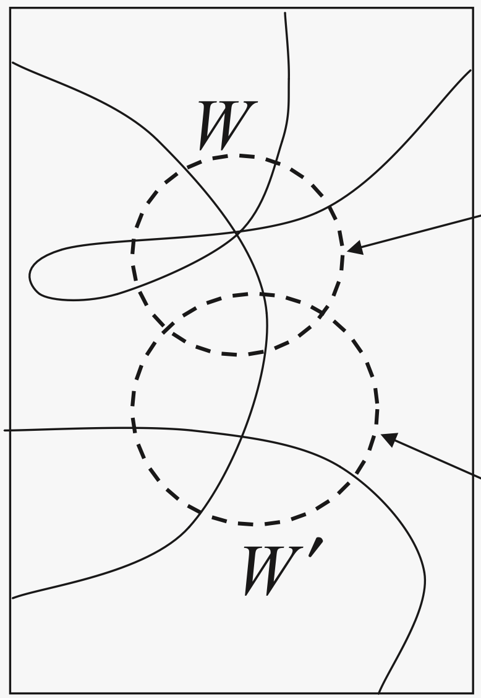

import {Center,ExampleBox,AppInteractive,AppUnbiased1,AppUnbiased3} from './components.jsx'

Hidden Unit Acrobatics
======================

*An introduction to*  
swaps, flips, and other symmetries  of singular networks  
*and*  
their applications

Interactive notebook talk  
*presented at the*  
[Singular Learning Theory & Alignment Summit](https://singularlearningtheory.com/)  
Berkeley, June, 2023

*Presented by*  
[**Matthew Farrugia-Roberts**](https://far.in.net)  
*of*  
the University of Melbourne

 

<ExampleBox name={"Abstract"}>
    A tutorial on ways of changing a neural network's weights so as to
    preserve the implemented function. (Setting: single-hidden-layer
    hyperbolic tangent networks, of theoretical interest in existing singular
    learning theory literature). I start with the well-known permutation
    symmetries, and give special emphasis to operations that only apply to
    'reducible' parameters, that is, those with a singular Fisher information
    matrix.

    This tutorial aims to enhance your intuitive understanding of the
    structure of the neural network parameter space. I discuss several
    algorithms and results that follow immediately given this intuitive
    understanding, including (as time allows) neural network compression and
    the construction of short piecewise-linear paths of equivalent
    parameters.
</ExampleBox>

Introduction
------------

*Hidden unit acrobatics:*
transformations of a neural network parameter vector that preserve the
implemented function.

These transformations are at the heart of my
    [MCS thesis](https://far.in.net/mthesis)
and my
    [associated](https://arxiv.org/abs/2305.05089)
    [preprints](https://arxiv.org/abs/2306.02834).

In fact the thesis is basically just a bunch of consequences that are pretty
obvious once you are fluent with these transformations, and I'm somewhat
surprised they haven't been developed before (to my knowledge).

The aims of this talk:

1.  Offer you the same fluency---ideally, you walk away able to write my
    MCS  thesis?

2.  Give a tour of some consequences relevant to deep learning and SLT.

Motivation: Refine our pictures of parameter space
--------------------------------------------------

Singular (statistical) learning theory (SLT) spends a lot of time talking
about the geometry of curves in the neural network parameter space. These are
often accompanied by sketches of curves with interesting singularities that
have loops, intersections, and so on.

    
    
    
    

The lesson of SLT is that the dynamics and asymptotics of (Bayesian) learning
are governed by the geometry of these singularities. So it's important to
have a clear picture for what the singularities actually look like for neural
networks in concrete examples.

**Note:** singularities != zero sets! Algebraic geometry also depends on
local shape of loss function around these sets.

Nevertheless, levels sets seems like a good start. Also, can lead to bounds
on RLCTs.

Example (one hidden unit)
-------

Consider a simple neural network with parameter $(a,b)$ implementing function
$a \tanh(b x)$.
(They don't get much simpler!)
With only two weights, we can easily visualise the parameter space.

<AppUnbiased1 />

The Fisher information matrix $\mathcal{I}(w)$ is singular if and only if
$a=0$ or $b=0$, that is, along the coordinate axes. This is the critical
locus of "true parameters" if the data is sampled from the zero function
(that is, a zero unit network).

**The challenge:** preserve this level of intuition as we add more hidden
units to this example.
(Eventually, we also want to add biases, layers, attention mechanisms, etc.,
but for now, we'll start with hidden units.)

The hyperbolic tangent architecture (unbiased)
----------------------------------------------

Consider a single-hidden-layer hyperbolic tangent neural network
architecture, with a single input unit, a single output unit, and
$h$ unbiased hidden units.

**Parameters:**
A *parameter* is a vector $w = (a_1,b_1,\ldots,a_h,b_h) \in \mathbb{R}^{2h}$.
The associated function is
    $f_w : \mathbb{R} \to \mathbb{R}$
where
    $f_w(x) = \sum_{i=1}^h a_i \tanh(b_i x)$.

<AppUnbiased3 />

Functional equivalence and symmetries
-------------------------------------

**Functional equivalence:**
Two parameters $w$ and $w'$ are *functionally equivalent* if
they implement the same function,
that is, if $f_w = f_{w'}$,
that is, if $\forall x \in \mathbb{R}, f_w(x) = f_{w'}(x)$.
Note: two parameters don't need to have the same number of hidden units
to be functionally equivalent.

(Note: here I consider unbounded parameter spaces. Some formal statements
break down for compact subsets of the parameter space.)

**Symemtries:**
A *symmetry* (of the parameter--function map) is a transformation of the
parameter space
    $T : \mathbb{R}^{2h} \to \mathbb{R}^{2h}$
that preserves functional equivalence, that is, $f_{T(w)} = f_w$ for all $w$.

Well-known symmetries
---------------------

Some well-known symmetries are as follows:

* **Unit swap:**
  A transformation  $\tau_{i,j}$ that exchanges the incoming and outgoing
  weights of unit $i$ with those of unit $j$.
  $\tau_{i,j}$ is a symmetry because of the commutativity of the sum defining
  the output of the network, that is,

  $a\tanh(bx) + a'\tanh(b'x) = a'\tanh(b'x) + a\tanh(bx)$.

* **Unit flip:**
  A transformation $\sigma_i$ that negates the incoming and outgoing weights
  of hidden unit $i$.
  $\sigma_i$ is a symmetry because the hyperbolic tangent is an odd function,
  so 

  $(-a)\tanh((-b)x) = -a\tanh(-bx) = a\tanh(bx)$.

These basic symmetries can be combined in various sequences, generating a
group of symmetries of order
    $h! \cdot 2^h$.
Each of those symmetries can be expressed as a permutation of the hidden
units followed by negation of the weights for some subset of the units.

No other analytic(!) symmetries
-------------------------------

According to a result of Chen, Lu, and Hecht-Nielsen
  ([1993](https://doi.org/10.1162/neco.1993.5.6.910)),
there are no other *analytic* symmetries for this architecture.

Similarly, according to a result of Sussmann
  (<a href="https://doi.org/10.1016/S0893-6080(05)80037-1">1992</a>),
two parameters are functionally equivalent if and only if they
are related by some number of swaps and flips,
  (except for some measure zero sets of degenerate parameters, where you
  might need more).

(There are generalisations of these results to more activation functions and
architectures: e.g., Kůrková and Kainen, 1994; Vlačić and Bölcskei, 2021.)

What about non-analytic symmetries? What about those measure zero sets of
degenerate parameters?

Sussmann's reducibility conditions
----------------------------------

A network is *reducible* if and only if if meets any of the following
conditions:

1. $a_i = 0$ for some $i$, or

2. $b_i = 0$ for some $i$, or

3. $b_i = b_j$ for some $i \neq j$, or

4. $b_i = -b_j$ for some $i \neq j$.

New symmetries
--------------

If any of these conditions occur, then there are additional symmetries (not
flips or swaps).

1.  When $a_i = 0$, you can set $b_i$ to anything.

    $0 \tanh (b x) = 0$

2.  When $b_i = 0$, you can set $a_i$ to anything.

    $a \tanh (0 x) = 0$

3.  When $b_i = b_j$, you can vary outgoing weights if you keep $a_i + a_j$
    constant.

    $a_i \tanh(b x) + a_j \tanh(b x) = (a_i+a_j) \tanh(b x)$

4.  When $b_i = -b_j$, you can vary outgoing weights if you keep $a_i - a_j$
    constant.

    $a_i \tanh(b x) + a_j \tanh(- b x) = (a_i-a_j) \tanh(b x)$

(It's a little more subtle when you have biases, but qualitatively similar.)

Demonstration
-------------

<AppUnbiased3 />

 

Lossless neural network compression and 'layer rank'
----------------------------------------------------

Through these kinds of variations, you can systematically eliminate redundant
units and get a smaller network implementing the same function.

1.  When $a_i = 0$, remove unit $i$ (it doesn't contribute).

2.  When $b_i = 0$, remove unit $i$ (it doesn't contribute).

3.  When $b_i = b_j$, merge the units $i$ and $j$. That is, set unit $i$'s
    outgoing weight to $a_i + a_j$ and remove unit $j$.

4.  When $b_i = -b_j$, merge the units $i$ and $j$, similarly.

(You can just iteratively apply these terms until there are no more
reducibility conditions satisfied, it will terminate).

The size of the resulting, compressed network is some kind of 'effective'
number of units in the original network. I call this the **rank** of the
parameter.

Piecewise linear path connectivity
----------------------------------

The above discussion sketches out the local shape of the set of equivalent
parameters (local degrees of freedom).

What about the global picture? We can say one interesting thing about its
*path connectivity*.

Assume a fixed parameter space / number of hidden units.

* The subset of equivalent parameters contains a piecewise linear path between
  any pair of parameters.

* If the rank of the parameters is at most $h/2$, there exist exist such paths
  of length at most 7. Highly connected!

Detecting proximity to low-rank regions
---------------------------------------

It's easy to recognise when your parameter has low rank, but it probably
doesn't.

It would be nice if we could tell if a parameter 'almost' has low rank.
That is, it is within $\epsilon$ distance of the set of rank $r$ parameters.

If we use uniform distance ($L_\infty$ distance) which decouples each
dimension in parameter space, we can consider how you could perturb each
weight independently and end up with a reducible (low-rank) parameter.

Unfortunately, detecting this proximity is an NP-complete problem in general.
However, it seems like it should be possible to approximately detect with
good accuracy in practice.

Summary
-------

Traditional model of parameter space:

* Due to basic flip and swap symmetries, parameter space divided into
  'wedges' that are reflected versions of each other.
* The interior of each slice contains a copy of each (irreducible) function
  you can implement with any parameter
* The boundaries are weird and we'll leave them for later / they probably
  don't matter

My refinement:

* The boundaries (reducible parameters) are actually not that complex to
  describe!
* You can map out the additional symmetries, and say interesting things:
  * There are the operations I described.
  * Interesting combinations of them lead to lossless compression.
  * You can construct continuous paths through the sets.
* The core identity of a network parameter is an unordered, weighted set of
  some number of affine-tanh basis functions, the rest (order, splitting, etc.)
  is implementation details.
* The reducible functional equivalence classes are complex networks of
  piecewise linear paths connecting:
  * a network of different permutations of 'core' units with additional
   'blank' units, plus
  * additional appendages representing splitting core units or varying
    incoming/outgoing weights of other units

The case with biases is slightly more intricate. The case with
multi-dimensional inputs/outputs is basically the same. Both worked out in my
thesis.

Why care about the case $\mathrm{rank}(w) < h$?
--------------------------------------

They are a measure zero set of the high-dimensional parameter space!

* But learning != randomly sampling weights: reducible models are candidates
  for model selection.
* They have some advantages (MDL, degrees of freedom), 
* Consider learning in the overparameterised regime:
  * As soon as the network has +1 more units than required to implement a
    data set, reducible functions are among those that achieve zero loss
  * Under vast overparameterisation, the condition $\mathrm{rank}(w) < h/2$
    is also satisfied.

Reduced-rank parameters may be theoretically important

* They are the sites of information singularities
  (in tanh case, Fisher information matrix is degenerate at w if and only if
  w is reducible).

But you could never actually reach a low-rank parameter, due to numerical
imprecision

* You could come close enough that approximate version of the theory holds.
* These parameters might have 'influence' over their surrounding parameter
  landscape, and be useful 'landmarks' for understanding learning dynamics.
* It is already known that these points are the sites of interesting critical
  points (saddles, local minima, etc.; see some work by Amari *et al.*)

Well, *do* we ever come close to these parameters in practice?

* This hasn't been directly tested.
* Lots of evidence that often significant pruning (or more general
  compression) is possible for learned networks without changing the function
  much
* This *could* indicate approximate lossless compressibility\* of learned
  networks

(Wait, "approximately lossless"? do you mean "lossy"? no---we consider an
epsilon-relaxation of the compression algorithm rather than the compression
problem.)

Next steps / open problems
----------

Relevance in practice?

* In practical deep learning, are learned networks near low-rank regions?
* Let's start with some simple toy experiments this week to confirm or deny.
* (After that, should be straightforward to push the theory beyond tanh to
  deeper networks)
* Attention layers, etc.?
  Not sure anyone has studied even basic symmetries of attention layers there
  (anyone seen this?)

Reducible parameters are information singularities, but... what role do they
play in the SLT story of deep learning?

* are rank neighbourhoods good candidates for phases?
* can this greater understanding of the parameter space help us understand
  formulas for the RLCT?
* simply counting degrees of freedom can lead to an upper bound on RLCT for
  these parameters (the RLCT could be lower due to 'mutually exclusive'
  degrees of freedom and due to non-quadratic local shape in other
  directions).

We only consider *exact* functional equivalence on *all* of the input space.

1.  There will be more ways in which two networks can be functionally
    equivalent on discrete subsets of the parameter space (e.g., a data set)
2.  There will be more ways in which two networks can be *similar* as
    functions (rather than exactly equal).
3.  There will be more ways in which two networks can have similar loss than
    if they implement identical functions.

So the curves discussed here are part of the story but not the whole story.
I think there is some existing work on this, I am not across it. Good place
to start. Ask me for bibliography.

(h/t Zach Furman.)

*fin*
=====

 

Visualisation (unbiased)
------------------------

<AppInteractive biased={false} />

Visualisation (biased)
----------------------

<AppInteractive biased={true}/>

